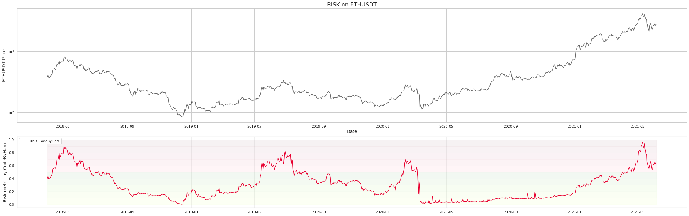
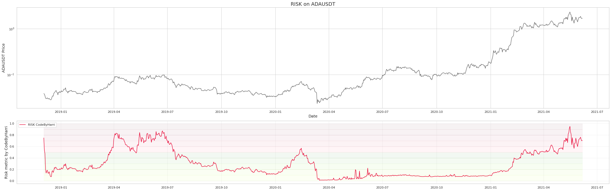

 *Roses are red, violets are blue. This is not financial advice, I genuinely have no clue.* 

 
 

**Last Updated: 6/06/2021**

 
Simply put this tool is used to dynamically dollar cost average your purchases of a crypto. The risk metric is calculated using some stacked machine learning methods featured on my github. 
The risk is associated with how much you should be allocating. 

<h2>Bitcoin Risk Metric</h2>

 
 

<h2>Ethereum Risk Metric</h2>

 
 

<h2>Cardano Risk Metric</h2>

