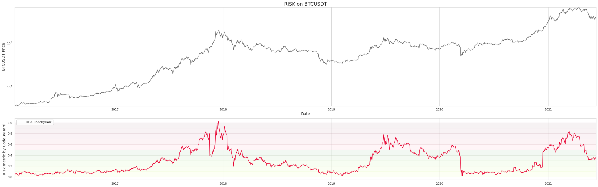

 *Roses are red, violets are blue. This is not financial advice, I genuinely have no clue.* 

 
 

**Last Updated: 13/06/2021**

 
Simply put this tool is used to dynamically dollar cost average your purchases of a crypto. The risk metric is calculated using some stacked machine learning methods featured on my github. 
The risk is associated with how much you should be allocating. 

<h2>Bitcoin Risk Metric</h2>

<h2>How is the risk calculated?</h2>

Given the BTCUSD data from Yahoo Finance 8 features are created, listed belowed in the diagram. These 8 features are used to predict the normalised price between local highs and lows. The models used are sklearns Extra Trees, Random Forrest and Linear Regression. This process is optimised using Optuna. 

